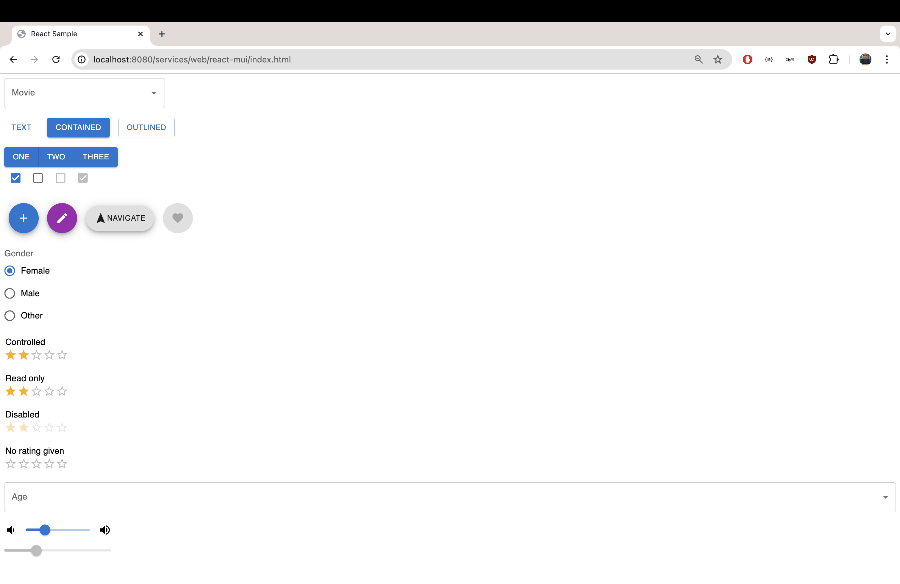

# React - MUI

## Components

- [Autocomplete](https://mui.com/material-ui/react-autocomplete/)
- [Button](https://mui.com/material-ui/react-button/)
- [Button Group](https://mui.com/material-ui/react-button-group/)
- [Checkbox](https://mui.com/material-ui/react-checkbox/)
- [Floating Action Button](https://mui.com/material-ui/react-floating-action-button/)
- [Radio Group](https://mui.com/material-ui/react-radio-button/)
- [Rating](https://mui.com/material-ui/react-rating/)
- [Select](https://mui.com/material-ui/react-select/)
- [Slider](https://mui.com/material-ui/react-slider/)
> _**Note:** Material UI Icons are not distributed as UMDs, hence, can't be used._



## Changes

### Imports
```js
import * as React from 'react';
import Stack from '@mui/material/Stack';
import Button from '@mui/material/Button';
```

->

```js
const {
  Stack,
  Button,
} = MaterialUI;
```

### Exports

```js
export default function BasicButtons() {
...
```

->

```js
function BasicButtons() {
...
```

### Icons

Browse icons at: https://fonts.google.com/icons

```js
<VolumeUp />
```

->

```js
<span class="material-icons">volume_up</span>
```

```js
import * as React from 'react';
import Box from '@mui/material/Box';
import Stack from '@mui/material/Stack';
import Slider from '@mui/material/Slider';
import VolumeDown from '@mui/icons-material/VolumeDown';
import VolumeUp from '@mui/icons-material/VolumeUp';

export default function ContinuousSlider() {
  const [value, setValue] = React.useState(30);

  const handleChange = (event, newValue) => {
    setValue(newValue);
  };

  return (
    <Box sx={{ width: 200 }}>
      <Stack spacing={2} direction="row" sx={{ mb: 1 }} alignItems="center">
        <VolumeDown />
        <Slider aria-label="Volume" value={value} onChange={handleChange} />
        <VolumeUp />
      </Stack>
      <Slider disabled defaultValue={30} aria-label="Disabled slider" />
    </Box>
  );
}

```

->

```js
const {
    Box,
    Stack,
    Slider
} = MaterialUI;

function ContinuousSlider() {
    const [value, setValue] = React.useState(30);

    const handleChange = (event, newValue) => {
        setValue(newValue);
    };

    return (
        <Box sx={{ width: 200 }}>
            <Stack spacing={2} direction="row" sx={{ mb: 1 }} alignItems="center">
                <span class="material-icons">volume_down</span>
                <Slider aria-label="Volume" value={value} onChange={handleChange} />
                <span class="material-icons">volume_up</span>
            </Stack>
            <Slider disabled defaultValue={30} aria-label="Disabled slider" />
        </Box>
    );
}
```
