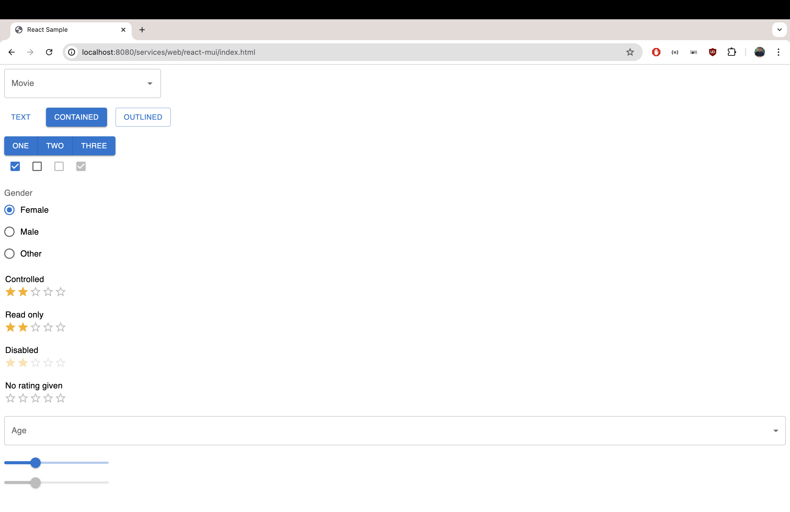

# React - MUI

## Components

- [Autocomplete](https://mui.com/material-ui/react-autocomplete/)
- [Button](https://mui.com/material-ui/react-button/)
- [Button Group](https://mui.com/material-ui/react-button-group/)
- [Checkbox](https://mui.com/material-ui/react-checkbox/)
- [Floating Action Button](https://mui.com/material-ui/react-floating-action-button/)
- [Radio Group](https://mui.com/material-ui/react-radio-button/)
- [Rating](https://mui.com/material-ui/react-rating/)
- [Select](https://mui.com/material-ui/react-select/)
- [Slider](https://mui.com/material-ui/react-slider/)
> _**Note:** Material UI Icons are not distributed as UMDs, hence, can't be used._



## Changes

### Imports
```js
import * as React from 'react';
import Stack from '@mui/material/Stack';
import Button from '@mui/material/Button';
```

->

```js
const {
  Stack,
  Button,
} = MaterialUI;
```

### Exports

```js
export default function BasicButtons() {
...
```

->

```js
function BasicButtons() {
...
```
